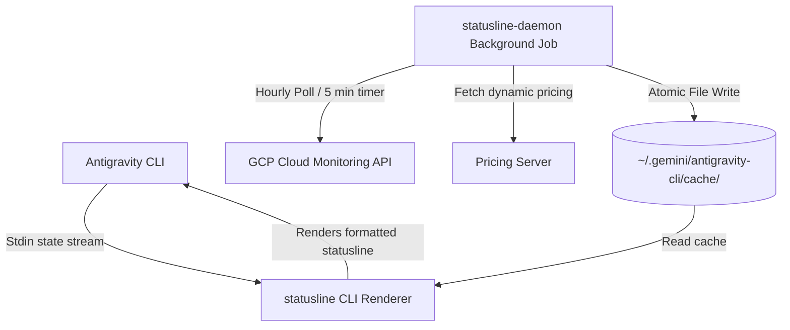

# Antigravity Status Line (`statusline`)

A high-performance, real-time status line rendering engine and background billing daemon for tracking Vertex AI token counts, session metrics, and estimated API expenses directly inside the Antigravity CLI.

---

## Key Features

* **High-Speed Rendering (`<2ms` latency)**: Written in Go, the offline renderer processes standard input and formats metrics instantly on every keystroke.
* **Background billing daemon (`statusline-daemon`)**: Periodically polls Google Cloud Monitoring in the background to aggregate Vertex AI API token metrics for the current billing day.
* **Dynamic Pricing Engine**: Gracefully parses and maps exact and wildcard models to current pricing configurations.
* **Responsive Breakpoints**: Smart layouts dynamically scale across four terminal width breakpoints:
  * **Wide ($\ge 110$ columns)**: Detailed turn, session, and daily costs, with model name and visual state.
  * **Standard ($85 \le \text{width} < 110$)**: Focused turn details, session tokens, daily costs, and state indicators.
  * **Compact ($60 \le \text{width} < 85$)**: Condensed representation displaying active session and today's usage statistics.
  * **Minimal ($< 60$ columns)**: Ultra-compact, displaying active turn state and simplified cost.
* **Zero-Downtime Resilience**: Implements lock-free atomic cache updates (`.tmp` write & atomic POSIX rename) to prevent I/O blocking during active terminal sessions.

---

## Architecture Overview



---

## Installation

### Method 1: Developer / Source Installation (Recommended)
This compiles the binaries locally for your exact CPU architecture and installs them directly without downloading any compiled assets over the network.

1. Clone this repository:
   ```bash
   git clone https://github.com/chrisrickenbacher/antigravity-statusline.git
   cd antigravity-statusline
   ```
2. Build and install locally:
   ```bash
   make install
   ```

### Method 2: Standard Installation (Binary Release)
Fetch precompiled binaries directly from GitHub releases:
```bash
curl -fsSL https://raw.githubusercontent.com/chrisrickenbacher/antigravity-statusline/main/install.sh | bash
```

---

## Developer Guide & Makefile Commands

The included `Makefile` automates compilation, testing, cross-compilation, and platform installation tasks.

### Core Commands

| Command | Action |
| :--- | :--- |
| `make build-local` | Compiles `statusline` and `statusline-daemon` binaries directly in the repository root. |
| `make build-current` | Compiles the binaries with the target platform suffix (e.g. `statusline-darwin-arm64`) under the `releases/` directory. |
| `make install` | Compiles current platform binaries and runs `install.sh` to configure plist/systemd environments. |
| `make build-releases` | Cross-compiles optimized production binaries for all major platforms (Darwin/Linux x AMD64/ARM64). |
| `make test` | Runs the full Go test suite (`go test -v ./...`). |
| `make clean` | Purges all generated local binaries and compiled release folders. |

---

## Configuration & GCP Authentication

Since background daemons triggered via `launchd` or `systemd --user` do not run in interactive shells, they lack access to interactive terminal environment variables (e.g., custom `$PATH` or ephemeral parameters). 

* **How it works**: The `install.sh` script captures active Google Cloud environment configurations (e.g., `GOOGLE_APPLICATION_CREDENTIALS` and `GCP_PROJECT_ID`) during execution and injects them directly into the generated scheduler service files.
* **Activating GCP Credentials**: To allow the background daemon to query Google Cloud Monitoring metrics, authenticate your local user session with Application Default Credentials:
  ```bash
  gcloud auth application-default login
  ```

---

## Uninstallation

To cleanly wipe all binaries, disable background schedulers, and restore your original `settings.json` configuration, run:
```bash
./uninstall.sh
```
