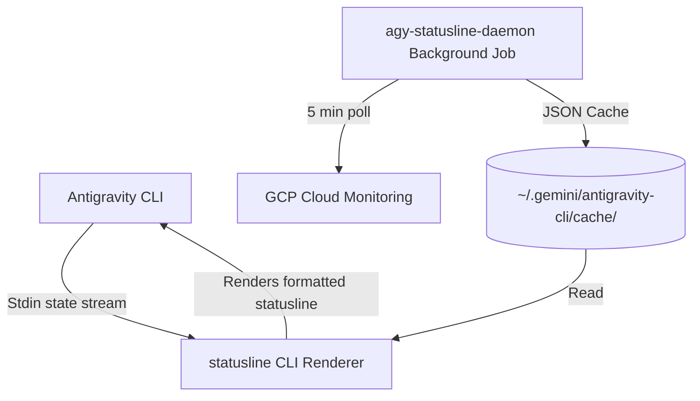

# Architecture Diagram

This document illustrates the design and pipeline of the Antigravity Status Line rendering engine and background billing daemon.

## Description

1. **State Parsing (`statusline`)**: The CLI renderer reads structured snake_case payloads from stdin, computes turn/session costs using local caches, and prints formatted output to stdout in $<2\text{ms}$.
2. **Billing Daemon (`agy-statusline-daemon`)**: A background service (configured via systemd or launchd) that runs periodically, queries GCP Monitoring for active Vertex AI usage metrics, fetches model pricing rates, and atomically caches the data as JSON files.
